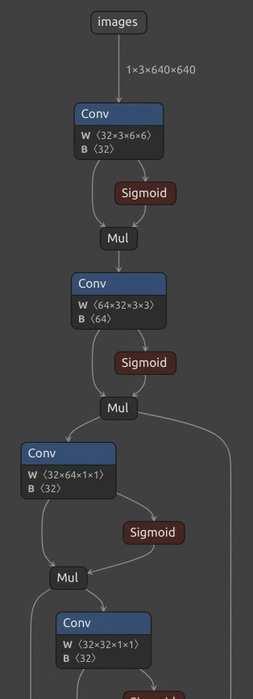

Hello world!
I want to take notes about my learnings. I think this can help me memorizing those importing things.

---
### Convolution-BatchNorm Fusion

Recently, I am studying the [Yolov5](https://github.com/ultralytics/yolov5) model. As you might know, it is a very famous Object Detection model. I start by visualizing the model using [Netron](https://github.com/lutzroeder/netron).

  

Figure 1: shows the model architecture of Yolov5s.

You can notice that there is no BatchNorm layer inside the graph. It is quite strange. BatchNorm is a common practice in almost all model architectures having CNN inside. It is a very important normalization layer which enables a successful training for deep neural network. After some searchings on google, I finally realize that there is indeed BatchNorm layer in standard Yolov5 model. However, it is fused into the CNN layer and that's why the graph doesn't show it. Doing this brings the benefit of a faster inference time. But keep in mind that we can only do Convolution-BatchNorm fusion for the inference stage only.

Let's recall the operation of Convolution and BatchNorm and see how they can be fused together.
To simplify the math notation, let's assume we are doing a $n$ x $n$ convolution, having an input channel of $c_i$ and output channel of $c_o$. Basically, for every $n$ x $n$ x $i$ sub-tensor of the input tensor, we do an elementwise multiplication with the kernel, which has the same shape, and we sum them up, and finally we add a bias to the sum.

$$Conv(T, K) = \sum_{h=1}^{c_i} \sum_{i=1}^{n} \sum_{j=1}^{n} T_{h,i,j}K_{h,i,j} + b $$

Note that $T$ is the sub-tensor of the input, $K$ is the kernel, and $b$ is the bias. As we have $c_o$ output channel, we do $c_o$ times of convolution for any T using {($K_1, b_1$), ($K_2, b_2$), ..., ($K_{c_o}, b_{c_o}$)}.

The BatchNorm basically shifts and scales the input. It tries to limit the input value to a smaller range. It does the operation as follows:

$$ BatchNorm(x) = \gamma \frac{x-\mu}{\sigma + \epsilon} + \beta $$

Note that $\gamma, \beta$ are the learnable parameter of the BatchNorm layer, while the $\mu, \sigma$ are the statistics of the training data. (We add a very small $\epsilon$ to prevent the problem of dividing by zero.) Once we finished the training process, all these four parameters are fixed. Therefore, we can combine them into the convolution operation.

$$
\begin{aligned}
BatchNorm(Conv(T, K)) & = \gamma \frac{Conv(T, K)-\mu}{\sigma + \epsilon} + \beta \\
& = \gamma \frac{\sum_{h=1}^{c_i} \sum_{i=1}^{n} \sum_{j=1}^{n} T_{h,i,j}K_{h,i,j} + b -\mu}{\sigma + \epsilon} + \beta \\
& = \sum_{h=1}^{c_i} \sum_{i=1}^{n} \sum_{j=1}^{n} T_{h,i,j} \frac{\gamma K_{h,i,j}}{\sigma + \epsilon} + \frac{\gamma (b-\mu)}{\sigma + \epsilon} + \beta
\end{aligned}
$$

You can find that the equation above looks similar to the standard convolution. But this time the kernel is scaled by $\frac{\gamma}{\sigma + \epsilon}$, and the bias is scaled by $\frac{\gamma}{\sigma + \epsilon}$ and then shifted by $\beta - \frac{\gamma \mu}{\sigma + \epsilon}$. Therefore, by adjusting the kernel and the bias of the convolutional layer, we can then merge the BatchNorm layer into it.

#### Reference:

[Fusing batch normalization and convolution in runtime](https://nenadmarkus.com/p/fusing-batchnorm-and-conv/)

Last update: Oct 23, 2022
